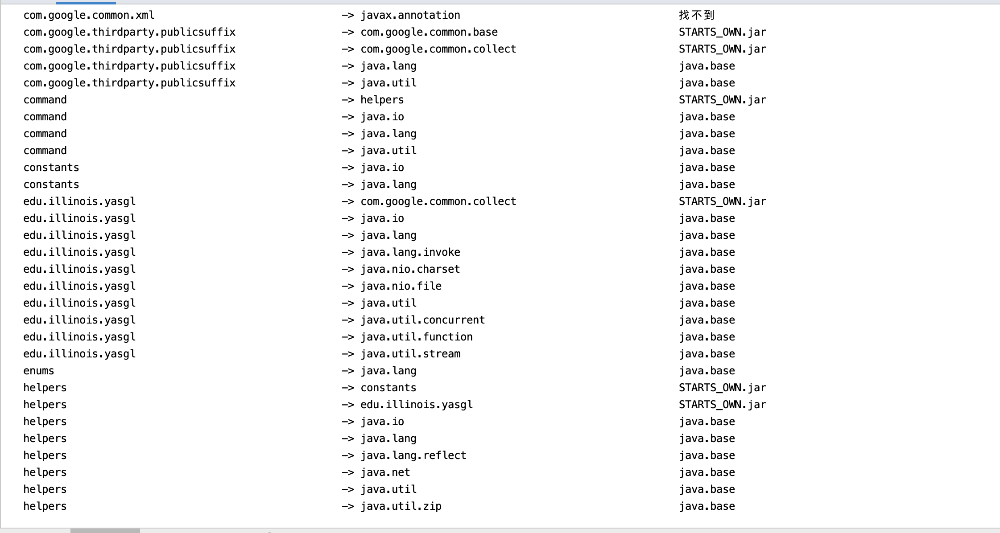
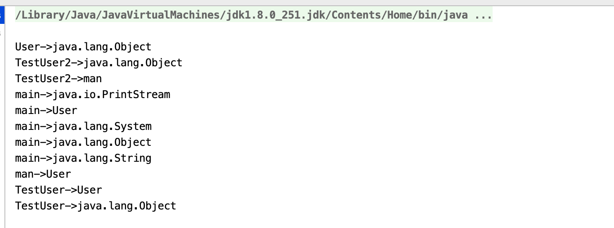
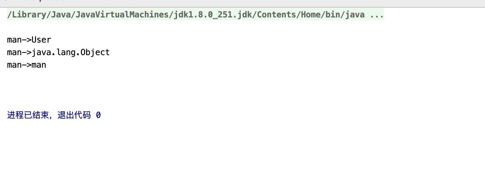

[TOC]


# 1.文献资料积累

## 1.1 基本情况

1.  回归测试是软件开发的重要组成部分。在每次代码更改之后，开发人员运行回归测试套件中的测试，以确保更改不会破坏任何现有功能。然而，当回归测试套件包含许多测试时，在每次更改之后运行所有测试(通常称为RetestAll)非常耗时，并减慢了软件开发过程。回归测试选择(RTS)是通过选择只运行受更改影响的测试来降低回归测试成本的一种方法。RTS技术的工作原理是**找到每个测试的依赖关系，并选择依赖于更改的测试。运行更少但必要的测试可以加快回归测试，同时确保不会错过任何测试失败。**

2.  **STARTS构造一个与所有类型相关的的依赖关系图(包括类、接口和枚举)，并为每个测试计算一个传递闭包，以找到它的依赖项。STARTS通过计算每个类型对应的已编译类文件的校验和，并将计算得到的校验和与上一次运行中计算得到的校验和进行比较，来确定更改的类型**。 STARTS选择运行受影响的测试，这些测试的传递依赖项包括一些已更改的类型。

## 1.2 实现目标

1. starts:help 列出starts所有的目标和它们的用途。
2. starts:diff 显示自上次运行Starts以来更改的所有Java类型(包括类、接口和枚举)。
3. starts:impacted 显示所有受变更影响的类型(不仅仅是测试类)，从而为变更影响分析提供了一种方法。
4. starts:select 显示(但不运行)自上次starts运行以来受更改影响的测试类—允许开发人员更灵活地首先选择受影响的测试，然后在稍后运行这些测试。
5. starts:starts 运行受影响的测试;它执行先前与rts相关的目标的功能，并执行受影响的测试。
6. starts:clean. 删除从上一次运行(在.starts目录中)中存储的所有starts工件，重新设置starts，以便在下一次运行时，认为所有类型都已更改(如果使用starts:starts，则选择所有测试运行)。

## 1.3 实现步骤

1. **查找类型之间的依赖关系**：
   - starts需要计算应用程序中所有**类型之间的依赖关系**。
   - 我们之前的工作中的原型使用ASM来解析给定类型的已编译类文件中的所有字节码，以便计算其依赖项。然而，解析整个类文件只是为了找到依赖项是相当缓慢的，因为它需要递归地访问每个类型的字段、方法、签名和注释来收集所引用的所有类型。
   - **starts通过只读取每个类文件中的常量池来确定类文件中的类型可能依赖的所有类型，从而改进了类型之间的计算依赖关系**。 我们使用最新的Oracle **jdeps**工具来读取常量池。在将应用程序的新修订编译为生成类文件之后，STARTS进行单个jdeps调用(通过jdeps API)来一次解析应用程序中的所有类文件，然后在内存中处理jdeps输出，以找到每种类型的依赖项。
2. **构建类型之间的依赖图**
   - *type-dependency graph (TDG)*
   - TDG包含从一种类型到它的每个依赖项的边。我们使用一个名为**yasgl**的自定义图形库来构造图形，并查找可以传递到某些已更改类型的测试。**我们将每种类型作为一个节点添加到yasgl图中，并添加由jdeps计算的依赖项作为图中节点之间的边。**
   - 使用yasgl图，STARTS计算每个测试类的传递闭包，以找到每个测试所依赖的所有类型。我们最初的原型使用了JGraphT，但是yasgl在计算传递闭包方面更快。例如，yasgl需要1.4秒来计算一个包含41,960个节点和509,946条边的图的传递闭包(来自一个拥有110个测试类的项目的单个模块)。JGraphT需要2.7秒来计算同一个传递闭包，当考虑到项目中的所有模块时，这种差异会不断累积。  请注意，**Starts使用的yasgl TDG不区分使用边和继承边**。
3. **查找已更改的类型**
   - STARTS查找自上次运行以来已更改的类型。
   - STARTS使用Ekstazi中的相同校验和函数来计算一个校验和，该校验和忽略每个类文件的调试相关信息，并将校验和存储到一个文件中。STARTS跟踪类文件中的变化，因为相应的源文件可能不同，但结果可能是实际执行的同一个类文件，因此跟踪类文件更精确。
   - 此外，STARTS程序**使用校验和来检查类文件是否被修改**，而不是看起来更快的方法，如时间戳，这可能是不可靠的(例如，Maven的增量构建系统被破坏了，经常在每次运行时重新编译每个类型，因此不能依赖类文件的时间戳)。
   - **在新版本中编译完成后，STARTS将计算所有已编译类文件的校验和，并将其与前一个版本中计算的存储校验和进行比较。如果新旧校验和不同，则STARTS认为该类型已更改**。
   - 如果该类型以前没有计算过的校验和(即，添加了一个新类型)，那么它的校验和将被存储以备将来运行。最后，如果在新版本中找不到先前为其计算校验和的类型(即删除了旧类型)，那么该类型将不再存储在校验和文件中以备将来运行。如果磁盘上没有校验和文件(例如，在第一次运行时，或者在运行mvn starts:clean之后)，starts会认为所有类型都已更改。
4. **计算和存储校验和**
   - 在我们最初的原型类型中，以及在Ekstazi中，图中每个测试类的传递闭包被存储为从每个测试类到它的依赖关系的映射，即测试到类型的映射。而且，每个测试有一个依赖文件。一旦一个工具计算已更改的类型集，然后检查每个测试的依赖项文件，看看测试是否依赖于任何更改的类型。 然而，我们观察到，由于静态分析固有的不精确性，与Ekstazi相比，**STARTS发现了更多的测试依赖项，而且许多测试共享了很多这些依赖项**。因此，我们在STARTS中**反转了依赖项存储格式**，通过**存储类型到测试的映射来减少对测试依赖项的重复检查**。 
   - 在单个文件中STARTS存**储从应用程序中的每个类型到依赖于该类型的测试集的映射**。该文件存储在应用程序根目录下名为.starts的目录中。更准确地说，如果应用程序是一个基于maven的**多模块项目**，那么STARTS会在每个模块下创建多个. starts目录，每个目录都有自己的类型到测试的映射文件，如果是依赖关系导致的，这些类型可以跨模块。在对新修订调用STARTS目标之后，可以打开或关闭存储在磁盘上的校验和。
   - start使用的“类型到测试”存储方式，加上只处理磁盘上的一个文件，极大地提高了选择受影响测试的性能。对测试到类型格式的一种可能的修改是，首先读取所有文件，然后在比较校验和之前将类型到测试的映射(在内存中)颠倒过来。然而,这一修改仍然会产生阅读的成本可能许多文件从磁盘,和它将mapping-reversal过程关键路径从测试开始时到开发人员获得测试results-mapping逆转开始可能发生在一个单独的离线阶段不是在关键路径。
5. **选择受影响测试**
   - STARTS使用来自上一个版本的类型到测试依赖关系映射和所有已更改类型集，以查找不受更改影响的测试。然后开始计算受影响测试，将其作为当前修订中的所有测试集与非受影响测试集之间的差值。因此，新添加的测试总是在受影响的测试集中。查找受影响测试不需要在新修订上构造依赖关系图(允许更快地计算受影响测试)。 相反，STARTS读取类型到测试依赖项文件，该文件是根据上一版本中构建的依赖项图计算的。
   - 事实上，**STARTS只需要编译时信息就可以找到受影响的测试**，这允许阶段的清晰分离:
     - 分析阶段：查找更改和受影响的测试
     - 执行阶段：运行受影响的测试
     - 图计算阶段：构建依赖关系图，并使用它为下一个版本创建类型到测试的映射
     - 这种分离可以选择在“联机模式”(a、e和g相同时运行)或“脱机模式”(a和e相可以单独运行或与g相并行运行)运行STARTS。我们还没有实现切换在线/离线模式的目标，但报告离线模式的时间为在线模式的时间减去g阶段的时间。starts:select显示受影响的测试，但不运行它们。
6. **运行受影响测试**:
   - STARTS按前面描述的方式计算要运行的选定测试集：它将没有受到影响的测试排除在应用程序中的所有测试集之外。具体来说，STARTS会动态地将未受影响的测试添加到Surefire插件已经配置为不运行的测试集中。因此，当STARTS调用Maven Surefire插件来运行测试时，Surefire将只运行受更改影响的测试。
   - 目标starts:starts将执行前面的所有步骤，以查找更改的类型、选择受影响的测试并运行那些选定的测试。

# 2. jdeps的使用

### 2.1 jdeps简介

JDeps是*Java依赖关系分析工具* ，这是一个命令行工具，它处理Java字节码（意味着.class文件或包含它们的JAR），并分析类之间静态声明的依赖关系。 可以用各种方式过滤结果，并可以将其汇总到包或JAR级别。总而言之，它是检查各种形式的依赖图的非常有用的工具。

从Java 8开始，就可以在JDK的bin文件夹中找到JDeps可执行文件jdeps。


### 2.2 在命令行中使用jdeps

首先需要将项目打包成jar文件，可以将打包后的jar文件放在项目的根目录下，这时候在命令行运行`jdeps + jar包的名字`就可以得到以下结果：



### 2.3 在java代码中利用jdeps获得类之间的依赖关系

在这里实现的时候遇到了**问题**：jdeps是一个命令行工具，该怎么使用java代码去调用它呢？于是找到了github上面STARTS的开发者们开源的代码，进行了学习。

1. 首先他们通过 java.util.spi.ToolProvider来加载jdeps，这里面涉及到了一些关于java反射的知识。

   ```java
   Class<?> toolProvider = ClassLoader.getSystemClassLoader().loadClass("java.util.spi.ToolProvider");
   // getMethod获取并调用了toolProvider的findFirst方法
   // findFirst方法返回具有给定名称的ToolProvider的第一个实例，由ServiceLoader使用系统类加载器加载。
   // invoke用来调用findFirst方法
   Object jdeps = toolProvider.getMethod("findFirst", String.class).invoke(null, "jdeps");
   // 加载jdeps完成
   jdeps = Optional.class.getMethod("get").invoke(jdeps);
   ```

2. 接着启动jdeps并运行jdeps实例，然后将jdeps的输出赋给output并最终返回出去进行进一步处理。

   ```java
   jdeps = Optional.class.getMethod("get").invoke(jdeps);
   toolProvider.getMethod("run", PrintWriter.class, PrintWriter.class, String[].class)
           .invoke(jdeps, new PrintWriter(output), new PrintWriter(output), args.toArray(new String[0]));
   ```

3. 最终将jdeps的输出存为一个类到它所依赖的所有类型的map，方便进行调用和输出

4. 我自己写了一个测试类来测试他们这部分代码的输出，输出的形式如下：

   

   有了这样的输出就能很好的获得类型之间的静态依赖关系，也就完成了STARTS工具实现的第一步。

# 3. yasgl的使用

论文中使用名为yasgl的自定义图形库来构造类型之间的依赖图，将每种类型作为一个节点添加到yasgl图中，并添加由jdeps计算的依赖项作为图中节点之间的边。

使用yasgl图，STARTS计算每个测试类的传递闭包，以找到每个测试所依赖的所有类型。我们最初的原型使用了JGraphT，但是yasgl在计算传递闭包方面更快。例如，yasgl需要1.4秒来计算一个包含41,960个节点和509,946条边的图的传递闭包(来自一个拥有110个测试类的项目的单个模块)。JGraphT需要2.7秒来计算同一个传递闭包，当考虑到项目中的所有模块时，这种差异会不断累积。  请注意，**Starts使用的yasgl TDG不区分使用边和继承边**。

## 3.1 引入依赖

在pom.xml中加入以下依赖：

```xml
<dependency>
  <groupId>edu.illinois</groupId>
  <artifactId>yasgl</artifactId>
  <version>1.2</version>
</dependency>
```

## 3.2 方法应用

1. 通过jdeps构造依赖类型之间的依赖图

   1. 调用yasgl提供的DirectedGraphBuilder类来构建类型之间的依赖图TDG

      ```java
      DirectedGraphBuilder<String> builder=new DirectedGraphBuilder<>();
      ```

   2. 将使用jdeps得到的类型之间的依赖关系当作边加入依赖图中

      ```java
      for(String key:deps.keySet()){
          for(String val:deps.get(key)){
              builder.addEdge(key,val);
          }
      }
      ```

   3. 这样就完成了类型之间的依赖图的构建

2. 根据yasgl构造的类型依赖图得到每一个类的依赖的传递闭包

   1. 首先需要一个方法来判断图中一个类能达到的其它所有的类，即和当前类之间存在依赖关系其它所有的类。调用yasgl提供的acceptForward方法来获得。

      ```java
      public static Set<String> computeReachabilityFromChangedClasses(Set<String> changed, DirectedGraph<String> graph) {
          final Set<String> reachable = graph.acceptForward(changed, new GraphVertexVisitor<String>() {
              @Override
              public void visit(String name) {
              }
          });
          return reachable;
      }
      ```

   2. 使用上述的方法对每一个待分析的类获得它依赖的所有类

      ```java
      Map<String, Set<String>> transitiveClosurePerClass = new HashMap<>();
      for (String test : classesToAnalyze) {
          Set<String> deps = computeReachabilityFromChangedClasses(
                  new HashSet<>(Arrays.asList(test)), graph);
          deps.add(test);
          transitiveClosurePerClass.put(test, deps);
      }
      return transitiveClosurePerClass;
      ```

   3. 编写测试，分析man这个类的所有依赖

      ```java
      public void testTDG() {
          CreateTDGWithYasgl createTDGWithYasgl = new CreateTDGWithYasgl();
          // 测试反转后的存储格式
          List<String> arg = new ArrayList<>(Arrays.asList("-v", "/Users/taozehua/Downloads/大三上学习资料/自动化测试/工具实现/test/test01/out/artifacts/test01_jar/test01.jar"));
          Map<String, Set<String>> depMap = LoadAndStartJdeps.runJdeps(arg);
          DirectedGraph<String> graph = createTDGWithYasgl.makeGraph(depMap);
          Map<String, Set<String>> resMap = createTDGWithYasgl.getTransitiveClosurePerClass(graph, Arrays.asList("man"));
          for (String key : resMap.keySet()) {
              for (String value : resMap.get(key)) {
                  System.out.println(key + "->" + value);
              }
          }
      }
      ```

      得到以下输出：
      

# 


