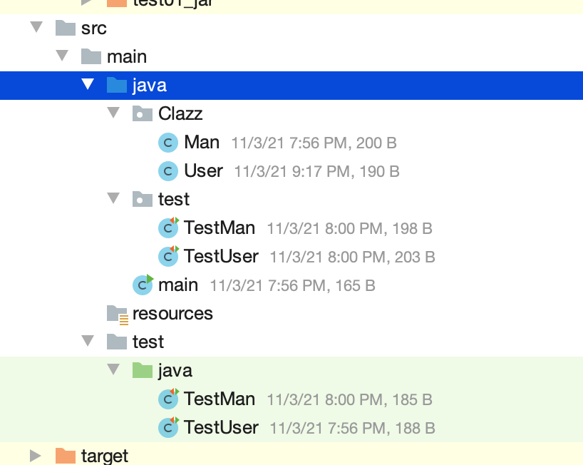
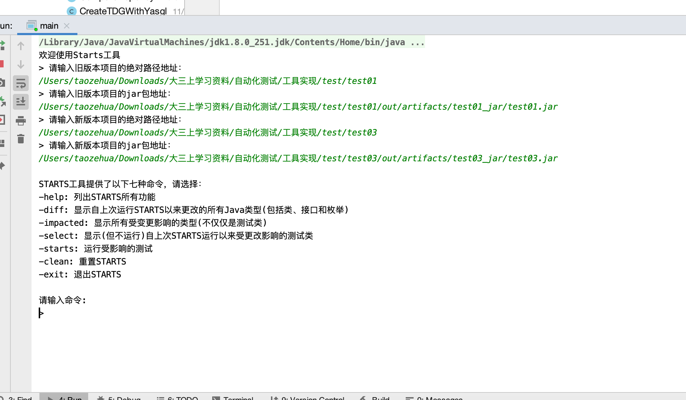
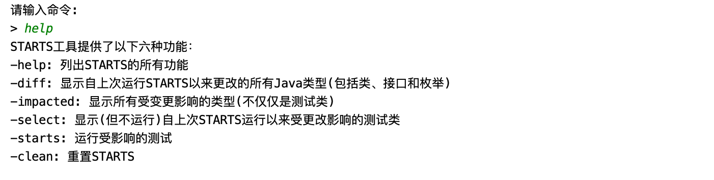
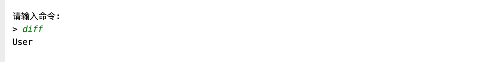
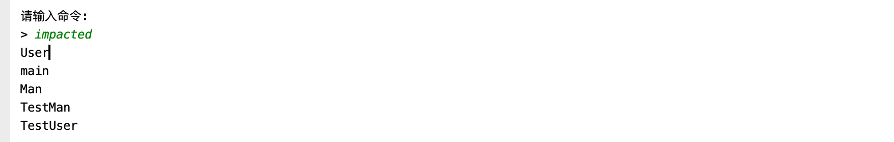
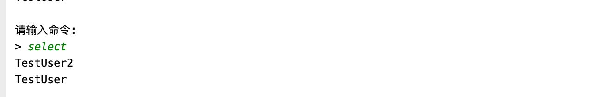
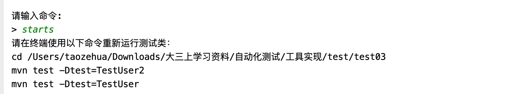
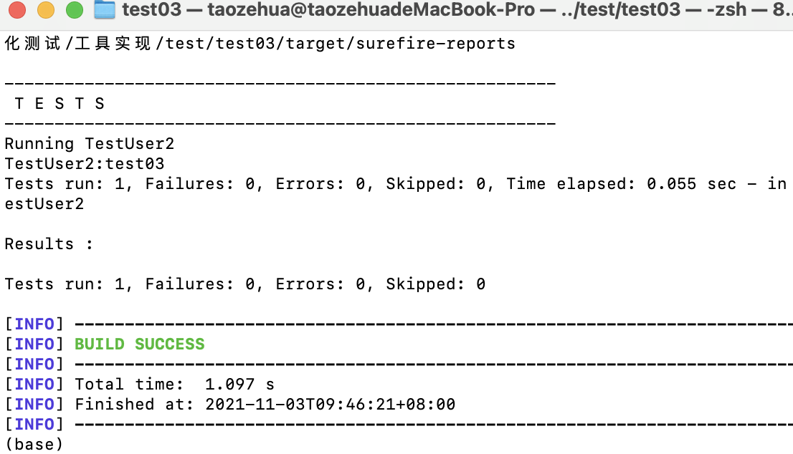
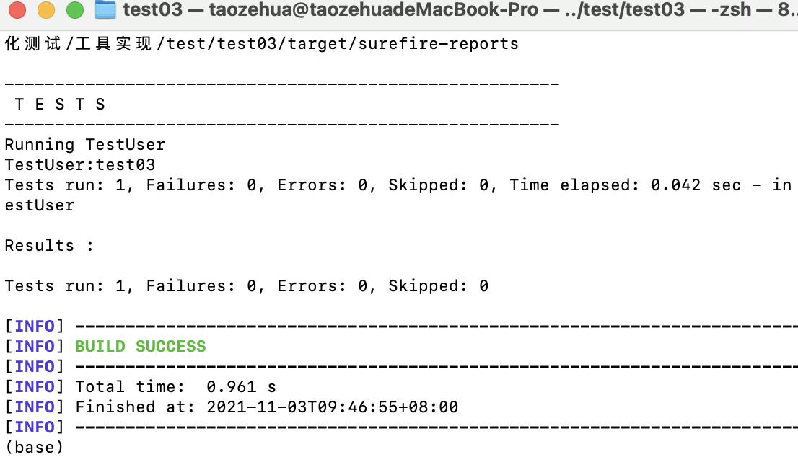

# Static-Test-Selection-Tool:STARTS

复现静态测试选择工具STARTS，STARTS是一个类级的静态回归测试用例选择工具。

## 1.工具介绍

### 1.1 基础知识
回归测试是软件开发的重要组成部分。在每次代码更改之后，开发人员运行回归测试套件中的测试，以确保代码的更改不会破坏任何现有功能。然而，当回归测试套件包含许多测试时，在每次更改之后运行所有测试非常耗时，并减慢了软件开发过程。回归测试选择(RTS)是通过选择只运行受更改影响的测试来降低回归测试成本的一种方法。RTS技术的工作原理是**找到每个测试的依赖关系，并选择受到更改影响的测试。运行更少但必要的测试可以加快回归测试，同时确保不会错过任何受到代码变更影响的测试用例。**

### 1.2 STARTS简介

STARTS是一个静态测试选择工具，它在没有实际执行程序的情况下对程序进行自动化分析。简单来说，STARTS构造一个与代码中所有类型相关的的依赖关系图(包括类、接口和枚举)，并为每个测试计算一个传递闭包，以找到它的依赖项。STARTS通过计算每个类型对应的已编译类文件的校验和，并将计算得到的校验和与上一次运行中计算得到的校验和进行比较，来确定更改的类型。 STARTS选择运行受影响的测试，这些测试的传递依赖项包括一些已更改的类型。

### 1.3 STARTS实现的目标
1. starts:help 列出STARTS所有的目标和它们的用途。
2. starts:diff 显示自上次运行STARTS以来更改的所有Java类型(包括类、接口和枚举)。（注意：更改的类型不包括新出现的或者删除的类型）
3. starts:impacted 显示所有受变更影响的类型(不仅仅是测试类)，从而为变更影响分析提供了一种方法。
4. starts:select 显示(但不运行)自上次STARTS运行以来受更改影响的测试类，允许开发人员更灵活地首先选择受影响的测试，然后在稍后运行这些测试。
5. starts:starts 运行受影响的测试
6. starts:clean 重新设置STARTS，以便在下一次运行时，认为所有类型都已更改(如果使用starts:starts，则选择所有测试运行)。


### 1.4 STARTS实现步骤
1. **查找类型之间的依赖关系**：
   - STARTS需要计算应用程序中所有**类型之间的依赖关系**。
   - **STARTS通过只读取每个类文件中的常量池来确定类文件中的类型可能依赖的所有类型，从而改进了类型之间的计算依赖关系**。 使用最新的Oracle **jdeps**工具来读取常量池。在将应用程序的新修订编译为生成类文件之后，STARTS进行单个jdeps调用(通过jdeps API)来一次解析应用程序中的所有类文件，然后在内存中处理jdeps输出，以找到每种类型的依赖项。
2. **构建类型之间的依赖图(type-dependency graph)**
   - TDG包含从一种类型到它的每个依赖项的边。使用一个名为**yasgl**的自定义图形库来构造图形，并查找可以传递到某些已更改类型的测试。**将代码中的每种类型作为一个节点添加到yasgl图中，并添加由jdeps计算的依赖项作为图中节点之间的边。**
   - 使用yasgl图，STARTS计算每个测试类的传递闭包，以找到每个测试所依赖的所有类型。**Starts使用的yasgl TDG不区分使用边和继承边。**
3. **查找已更改的类型**
   - STARTS查找自上次运行以来已更改的类型。
   - STARTS计算一个文件的校验和，该校验和忽略每个类文件的调试相关信息，并将校验和存储到一个文件中。STARTS跟踪类文件中的变化，因为相应的源文件可能不同，但结果可能是实际执行的同一个类文件，因此跟踪类文件更精确。
   - 此外，STARTS程序**使用校验和来检查类文件是否被修改**。**在新版本中编译完成后，STARTS将计算所有已编译类文件的校验和，并将其与前一个版本中计算的存储校验和进行比较。如果新旧校验和不同，则STARTS认为该类型已更改**。
   - 如果该类型以前没有计算过的校验和(即添加了一个新类型)，那么它的校验和将被存储以备将来运行。最后，如果在新版本中找不到先前为其计算校验和的类型(即删除了旧类型)，那么该类型将不再存储在校验和文件中以备将来运行。
4. **计算和存储校验和**：STARTS中**反转了依赖项存储格式**，通过**存储类型到依赖于该类型的测试的映射来减少对测试依赖项的重复检查**。 
5. **选择受影响测试**：STARTS使用来自上一个版本的类型到测试依赖关系映射和所有已更改类型集，以查找不受更改影响的测试。剩下的就是受影响的测试，需要重新运行。
6. **运行受影响测试**:
   - STARTS按前面描述的方式计算要运行的选定测试集，然后STARTS会使用Maven Surefire插件来运行测试时，Surefire将只运行受更改影响的测试。（因为没有实现成插件的形式，所以不能直接在用户的项目中运行测试。而是为用户提供了运行测试的所需要的命令，用户需要在自己的终端或者直接在项目目录下运行命令，观察测试的结果。）
   - 目标starts:starts将执行前面的所有步骤，以查找更改的类型、选择受影响的测试并运行那些选定的测试。

## 2. 模块构成

代码共分为6个模块

```java
/src/main/java/command
/src/main/java/constants
/src/main/java/helpers
/src/main/java/main.java
/src/test/java/helpersTest
/src/test/java/commandTest
```

1. **/src/main/java/command**：封装STARTS的六大功能
   - Help 列出STARTS所有的功能。
   - Diff 显示自上次运行STARTS以来更改的所有Java类型(包括类、接口和枚举)。
   - Impacted 显示所有受变更影响的类型(不仅仅是测试类)。
     - 根据已经更改的类型分析得到受这些更改的类型影响的类型
   - Select 显示(但不运行)自上次STARTS运行以来受更改影响的测试类
   - Starts 运行受影响的测试
     - 因为没有实现成插件的形式，所以不能直接在用户的项目中运行测试。而是为用户提供了运行测试的所需要的命令，用户需要在自己的终端或者直接在项目目录下运行命令，观察测试的结果。
       
   - Clean 重新设置STARTS，以便在下一次运行时，认为所有类型都已更改(如果使用starts:starts，则选择所有测试运行)。
     - 所以使用了序列化来实现clean的功能。使用一个status文本文件来存储当前STARTS的状态。如果status的内容为true，就代表用户上一次运行STARTS时使用了clean命令。那么这次运行时，STARTS会认为所有的类型都已经更改，需要选取所有测试运行。如果status的内容为false，就代表处于正常的状态，正常运行。
     - 每次用户输入clean命令，会将status的内容改写为true。下一次运行STARTS时，STARTS会认为所有的类型都已经更改，需要选取所有测试运行。
2. **/src/main/java/constants**：定义了各种常量，方便后续的使用
3. **/src/main/java/helpers**：实现了STARTS运行需要的各种工具类和方法
   - LoadAndStartJdeps类：使用jdeps对于给定的jar文件分析该jar文件对应的项目的各个类之间的依赖关系，并以`Map<String, Set<String>>`的形式存储，方便后续的使用
   - CreateTDGWithYasgl类：
     - makeGraph方法：根据LoadAndStartJdeps类使用jdeps生成的各个类之间的依赖关系，使用yasgl自定义图形库来构造TDG（类之间的依赖关系图）
     - getTransitiveClosurePerClass方法和computeReachabilityFromChangedClasses方法：使用makeGraph得到的类之间的依赖关系图计算得到待分析类列表中的每一个类的依赖传递闭包。（即每一个类和它依赖的所有类的映射关系）
   - ClassPath类：
     - getClasspathSet方法和getpath方法：根据项目的根目录路径获得该根目录下所有类和它们对应的绝对路径的映射
     - getAllClassName方法：获得项目中所有的类的名字
     - getAllTestClassesName方法：获得待测项目中的所有测试类的名字
   - ComputeDepency类：
     - testTotypeDependency方法：通过测试的名字和jdeps分析得到的依赖构建的TDG图计算该测试类所依赖的所有类型。
     - typeTotestDependency方法：由于STARTS采用“类型到依赖于该类型的所有测试“的存储方式，所以我们需要对testTotypeDependency方法得到的测试到该测试依赖的类型的映射进行反转，并且通过项目的根路径分析得到项目中所有类型到依赖于该类型的测试的映射关系。
   - CheckSum类：
     - getSingleCheckSum方法和getFileCRCCode方法：根据文件的路径计算文件的校验和。
     - getCheckSum方法：根据文件的路径列表，计算每一个文件的校验和并且存入checkSumMap中。
     - setCheckSumMap方法：计算一个项目中所有类型（除去测试类）和对应校验和的映射
     - writeCheckSumToFile方法：将计算得到的校验和写入文件
   - ImpactedTest类：
     - readFileAndCompare方法：比较新旧校验和文件，找出已更改的的类型
     - findImpactedTest方法：根据已更改的类型和项目中所有类型到依赖于该类型的测试的映射关系找到受影响的测试
4. **/src/main/java/main.java**：项目的启动代码存放的地方，负责提示用户进行输入，并根据用户的输入的命令提供相应的输出作为执行的结果。
5. **/src/test/java/helpersTest**：对/src/main/java/helpers下各个工具类的测试
6. **/src/test/java/commandTest**：对/src/main/java/command下实现命令的类的测试

## 3. 使用说明

### 3.1 使用注意事项（规范）

- 用户的项目中在标记为源码根和测试源码根的目录下都需要写测试类，即用户将测试源码根的目录下的测试类（测试用例）复制到源码根目录下。另外所有的测试类请以“Test”开头，方便jdeps的依赖关系的获取以及surefire插件执行受到代码变更影响的测试用例。示例项目结构如下图：
  

- 由于没有实现成插件的形式，所以需要使用者们自己使用命令进入修改后的代码的目录，再使用`mvn test -Dtest=类名`运行受影响的测试。用户需要在他们的项目中引入surefire插件的maven依赖，在pom.xml中加入如下依赖：

  ```xml
  <plugin>  
    <groupId>org.apache.maven.plugins</groupId>  
    <artifactId>maven-surefire-plugin</artifactId>  
    <version>2.17</version>  
  </plugin> 
  ```

- 用户需要确保电脑中的mvn命令是可用的

- 项目用户必须保存项目的旧版本和新版本，提供新旧版本的绝对路径，以便STARTS进行比较。

### 3.2 使用方法

1. 运行main.java，按照输出的提示输入旧版本项目的绝对路径地址和jar包地址、修改后新版本项目的绝对路径地址和jar包地址。输入完成后就会提示用户STARTS所具有的可以使用的命令，并提示用户继续输入命令。

   

2. 输入help命令会列出STARTS所有的功能

   

3. 输入diff命令会显示自上次运行STARTS以来更改的所有Java类型(包括类、接口和枚举)

   

4. 输入impacted命令会显示所有受变更影响的类型(不仅仅是测试类)

   

5. 输入select命令会显示(但不运行)自上次STARTS运行以来受更改影响的测试类

   

6. 输入starts命令会提示用户运行受影响的测试所需要的命令
   

   - 此时进入终端按照上述命令执行会得到如下结果，可以借此来判断用例是否执行成功，以及代码的变更是否对某些功能造成影响
      
   
      
   
7. 输入clean命令会重新设置STARTS并提示用户重置成功，以便在下一次运行时，认为所有类型都已更改(如果使用starts命令，则选择所有测试运行)。
   

8. 输入exit命令退出STARTS

