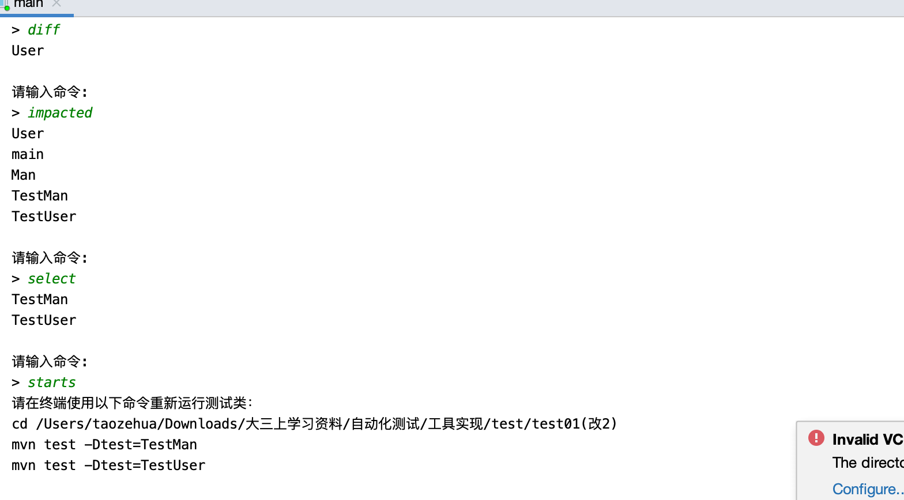

# Static-Test-Selection-Tool:STARTS复现

复现静态测试选择工具STARTS，STARTS是一个类级的静态回归测试用例选择工具。

## 1.工具介绍

### 1.1 基础知识
回归测试是软件开发的重要组成部分。在每次代码更改之后，开发人员运行回归测试套件中的测试，以确保代码的更改不会破坏任何现有功能。然而，当回归测试套件包含许多测试时，在每次更改之后运行所有测试非常耗时，并减慢了软件开发过程。回归测试选择(RTS)是通过选择只运行受更改影响的测试来降低回归测试成本的一种方法。RTS技术的工作原理是**找到每个测试的依赖关系，并选择受到更改影响的测试。运行更少但必要的测试可以加快回归测试，同时确保不会错过任何受到代码变更影响的测试用例。**

### 1.2 STARTS简介

STARTS是一个静态测试选择工具，它在没有实际执行程序的情况下对程序进行自动化分析。简单来说，STARTS构造一个与代码中所有类型相关的的依赖关系图(包括类、接口和枚举)，并为每个测试计算一个传递闭包，以找到它的依赖项。STARTS通过计算每个类型对应的已编译类文件的校验和，并将计算得到的校验和与上一次运行中计算得到的校验和进行比较，来确定更改的类型。 STARTS选择运行受影响的测试，这些测试的传递依赖项包括一些已更改的类型。

### 1.3 STARTS实现的目标
1. starts:help 列出STARTS所有的目标和它们的用途。
2. starts:diff 显示自上次运行STARTS以来更改的所有Java类型(包括类、接口和枚举)。（注意：更改的类型不包括新出现的或者删除的类型）
3. starts:impacted 显示所有受变更影响的类型(不仅仅是测试类)，从而为变更影响分析提供了一种方法。
4. starts:select 显示(但不运行)自上次STARTS运行以来受更改影响的测试类，允许开发人员更灵活地首先选择受影响的测试，然后在稍后运行这些测试。
5. starts:starts 运行受影响的测试
6. starts:clean 重新设置STARTS，以便在下一次运行时，认为所有类型都已更改(如果使用starts:starts，则选择所有测试运行)。


### 1.4 STARTS实现步骤
1. **查找类型之间的依赖关系**：
   - STARTS需要计算应用程序中所有**类型之间的依赖关系**。
   - **STARTS通过只读取每个类文件中的常量池来确定类文件中的类型可能依赖的所有类型，从而改进了类型之间的计算依赖关系**。 使用最新的Oracle **jdeps**工具来读取常量池。在将应用程序的新修订编译为生成类文件之后，STARTS进行单个jdeps调用(通过jdeps API)来一次解析应用程序中的所有类文件，然后在内存中处理jdeps输出，以找到每种类型的依赖项。
2. **构建类型之间的依赖图(type-dependency graph)**
   - TDG包含从一种类型到它的每个依赖项的边。使用一个名为**yasgl**的自定义图形库来构造图形，并查找可以传递到某些已更改类型的测试。**将代码中的每种类型作为一个节点添加到yasgl图中，并添加由jdeps计算的依赖项作为图中节点之间的边。**
   - 使用yasgl图，STARTS计算每个测试类的传递闭包，以找到每个测试所依赖的所有类型。**Starts使用的yasgl TDG不区分使用边和继承边。**
3. **查找已更改的类型**
   - STARTS查找自上次运行以来已更改的类型。
   - STARTS计算一个文件的校验和，该校验和忽略每个类文件的调试相关信息，并将校验和存储到一个文件中。STARTS跟踪类文件中的变化，因为相应的源文件可能不同，但结果可能是实际执行的同一个类文件，因此跟踪类文件更精确。
   - 此外，STARTS程序**使用校验和来检查类文件是否被修改**。**在新版本中编译完成后，STARTS将计算所有已编译类文件的校验和，并将其与前一个版本中计算的存储校验和进行比较。如果新旧校验和不同，则STARTS认为该类型已更改**。
   - 如果该类型以前没有计算过的校验和(即添加了一个新类型)，那么它的校验和将被存储以备将来运行。最后，如果在新版本中找不到先前为其计算校验和的类型(即删除了旧类型)，那么该类型将不再存储在校验和文件中以备将来运行。
4. **计算和存储校验和**：STARTS中**反转了依赖项存储格式**，通过**存储类型到依赖于该类型的测试的映射来减少对测试依赖项的重复检查**。 
5. **选择受影响测试**：STARTS使用来自上一个版本的类型到测试依赖关系映射和所有已更改类型集，以查找不受更改影响的测试。剩下的就是受影响的测试，需要重新运行。
6. **运行受影响测试**:
   - STARTS按前面描述的方式计算要运行的选定测试集，然后STARTS会使用Maven Surefire插件来运行测试时，Surefire将只运行受更改影响的测试。（因为没有实现成插件的形式，所以不能直接在用户的项目中运行测试。而是为用户提供了运行测试的所需要的命令，用户需要在自己的终端或者直接在项目目录下运行命令，观察测试的结果。）
   - 目标starts:starts将执行前面的所有步骤，以查找更改的类型、选择受影响的测试并运行那些选定的测试。

### 1.5 工具的创新点和优点

1. STARTS是基于类防火墙的类级静态回归测试用例选择工具。相比粗粒度和细粒度的测试选择技术来说，类级测试选择技术效果最优。STARTS能够通过静态分析较为精准的选取测试用例，也不会增加太多测试运行阶段的开销。
2. 由于静态分析固有的不精确性，与Ekstazi相比，STARTS发现了更多的测试依赖项，而且许多测试共享了很多这些依赖项。因此，在STARTS中反转了依赖项存储格式，通过存储类型到依赖于该类型的测试的映射来减少对测试依赖项的重复检查。 同时也极大的提高了选择受影响测试的性能，相比于Ekstazi工具运行分析的速度更快。

## 2. 模块构成

代码共分为6个模块

```java
/src/main/java/command
/src/main/java/constants
/src/main/java/helpers
/src/main/java/main.java
/src/test/java/helpersTest
/src/test/java/commandTest
```

1. **/src/main/java/command**：封装STARTS的六大功能
   
   - Help 列出STARTS所有的功能：
     - 简单的输出了STARTS的所有功能
     
   - Diff 显示自上次运行STARTS以来更改的所有Java类型(包括类、接口和枚举)。
     - 根据旧版项目和新版项目的根路径计算项目的所有类和其校验和的映射关系，并分别写入文件oldCheckSum和newCheckSum（调用CheckSum类的方法）。这时候在项目根路径下就会出现oldCheckSum和newCheckSum这两个文件。
     
       ```java
       // 计算旧版本的校验和并写入文件
       CheckSum checkSum = new CheckSum();
       Map<String, Long> resMapOld = checkSum.setCheckSumMap(rootPathOld);
       // 将校验和写入文件
       checkSum.writeCheckSumToFile(resMapOld, "oldCheckSum");
       // 计算新版本的校验和并写入文件
       CheckSum checkSum2 = new CheckSum();
       Map<String, Long> resMapNew = checkSum2.setCheckSumMap(rootPathNew);
       // 将校验和写入文件
       checkSum.writeCheckSumToFile(resMapNew, "newCheckSum");
       ```
     
     - 比较新旧校验和文件获得变更的类型并输出（根据STARTS实现者对diff的定义，这里变更的类型不包括新出现的类型和删除掉的类型）（调用ImpactedTest类的方法）
     
       ```java
       // 获得变更的类型(这里changedType不包括删除掉的类型，但是包括新出现的类型)
       Map<String, Long> changedType = impactedTest.readFileAndCompare(path1, path2);
       // 获得新出现的类型
       Map<String, Long> newType=impactedTest.getNewType();
       
       // 去除新出现的类型和删除掉的类型，只显示更改的类型
       ArrayList<String> changeTypeList=new ArrayList<>();
       for(String key:changedType.keySet()){
           if(!newType.containsKey(key)){
               changeTypeList.add(key);
           }
       }
       ```
     
   - Impacted 显示所有受变更影响的类型(不仅仅是测试类)。
     - 使用和Diff类似的步骤获得变更的类型
     
     - 获得项目中所有不是测试类的类名，存在commonTypeClass中。（调用ClassPath类的方法）
     
       ```java
       ClassPath classPath = new ClassPath();
       Map<String, String> classpathMap = classPath.getClasspathSet(rootPathNew);
       // 获得所有类的名称
       ArrayList<String> allClass = classPath.getAllClassName(classpathMap);
       // 获得所有测试类的名称
       ArrayList<String> testClassNew = classPath.getAllTestClassesName(allClass);
       // 获得不是测试类的类型
       ArrayList<String> commonTypeClass = new ArrayList<>();
       for (int i = 0; i < allClass.size(); i++) {
           if (testClassNew.indexOf(allClass.get(i)) == -1) {
               commonTypeClass.add(allClass.get(i));
           }
       }
       ```
     
     - 遍历commonTypeClass得到每一个类名，调用ComputeDepency类的testTotypeDependency方法获得该类依赖所有的类型。如果该类依赖的某个类型包含在变更的类型中，则认为该类受到了变更类型的影响，需要输出，将其加入到typeImpactedByChange列表中。
     
       ```java
       // 获得受更改的类型影响的类型
       ArrayList<String> typeImpactedByChange = new ArrayList<>();
       // 遍历所有不是测试类的类型
       for (String clazzName : commonTypeClass) {
           // 获得类型和该类型依赖的类型
           Map<String, Set<String>> typeDep = computeDepency.testTotypeDependency(clazzName, depMapOld);
           for (String key : typeDep.keySet()) {
               for (String name : typeDep.get(key)) {
                   // 若该类型依赖的某个类型在变更的类型中出现，则该类型会受到变更的影响，需要输出
                   if (changedType.containsKey(name)) {
                       if (typeImpactedByChange.indexOf(key) == -1)
                           typeImpactedByChange.add(key);
                       break;
                   }
               }
           }
       }
       ```
     
     - 根据变更的类型调用ImpactedTest类的findImpactedTest方法计算受变更影响的测试类并输出。注意这里不会输出新出现的测试。
     
       ```java
       // 获得受影响的测试
       ArrayList<String> impactedTestList = impactedTest.findImpactedTest(changedType, typeTotestDependencyMapNew);
       ```
     
   - Select 显示(但不运行)自上次STARTS运行以来受更改影响的测试类
     - 使用和Diff类似的步骤获得变更的类型。
     
     - 根据变更的类型调用ImpactedTest类的findImpactedTest方法计算受变更影响的测试类并输出
     
       ```java
       // 输出受影响的测试
       ArrayList<String> impactedTestList = impactedTest.findImpactedTest(changedType, typeTotestDependencyMapNew);
       ```
     
     - 获得新版本中新出现的测试类，若这些新的测试类不在变更影响的测试类中出现也需要加入到select命令输出的结果中
     
       ```java
       ClassPath classPath = new ClassPath();
       Map<String, String> classpathMap = classPath.getClasspathSet(rootPathNew);
       // 获得所有类的名称
       ArrayList<String> allClass = classPath.getAllClassName(classpathMap);
       // 获得所有测试类的名称
       ArrayList<String> testClassNew = classPath.getAllTestClassesName(allClass);
       
       // 获得新添加的测试
       ClassPath classPath2 = new ClassPath();
       Map<String, String> classpathMapOld = classPath2.getClasspathSet(rootPathOld);
       // 获得所有类的名称
       ArrayList<String> allClassOld = classPath2.getAllClassName(classpathMapOld);
       // 获得所有测试类的名称
       ArrayList<String> testClassOld = classPath2.getAllTestClassesName(allClassOld);
       // 获得新添加的测试，且没有出现在受影响测试的列表中
       ArrayList<String> newTest=new ArrayList<>();
       for(String test:testClassNew){
           if(testClassOld.indexOf(test)==-1 && impactedTestList.indexOf(test)==-1){
               newTest.add(test);
           }
       }
       impactedTestList.addAll(newTest);
       ```
     
   - Starts 运行受影响的测试
     - 根据select命令输出的受影响的测试列表生成相应的执行测试的命令并输出
     
       ```java
       if (impactedTestList.size() == 0) {
           System.out.println("没有受影响的测试需要运行");
           return;
       }
       // 运行受影响的测试类
       System.out.println("请在终端使用以下命令重新运行测试类：");
       System.out.println("cd " + rootPathNew);
       for (String impactedTest : impactedTestList) {
       System.out.println("mvn test -Dtest=" + impactedTest);
       ```
     
     - 因为没有实现成插件的形式，所以不能直接在用户的项目中运行测试。而是为用户提供了运行测试的所需要的命令，用户需要在自己的终端或者直接在项目目录下运行命令，观察测试的结果。输出样例如下：
       
     
   - Clean 重新设置STARTS，以便在下一次运行时，认为所有类型都已更改(如果使用starts:starts，则选择所有测试运行)。
     - 使用了序列化来实现clean的功能。使用一个status文本文件来存储当前STARTS的状态（status存在项目的根目录下）。如果status的内容为true，就代表用户上一次运行STARTS时使用了clean命令。那么这次运行时，STARTS会认为所有的类型都已经更改，需要选取所有测试运行。如果status的内容为false，就代表处于正常的状态，正常运行。
     
     - 每次用户输入clean命令，会将status的内容改写为true。下一次运行STARTS时，STARTS会认为所有的类型都已经更改，需要选取所有测试运行。
     
       ```java
       BufferedWriter writer = new BufferedWriter(new FileWriter("status"));
       // true代表下一次运行时，认为所有的类型都已经更改，需要选取所有测试运行
       writer.write("true");
       writer.flush();
       writer.close();
       ```
   
2. **/src/main/java/constants**：定义了各种常量，方便后续的使用

3. **/src/main/java/helpers**：实现了STARTS运行需要的各种工具类和方法
   - **LoadAndStartJdeps类**：使用jdeps对于给定的jar文件分析该jar文件对应的项目的各个类之间的依赖关系，并以`Map<String, Set<String>>`（类->该类依赖的所有类型）的形式存储，方便后续的使用
   
   - **CreateTDGWithYasgl类**：
     
     - makeGraph方法：根据LoadAndStartJdeps类使用jdeps生成的各个类之间的依赖关系，使用yasgl自定义图形库来构造TDG（类之间的依赖关系图）
     
       ```java
       DirectedGraphBuilder<String> builder=new DirectedGraphBuilder<>();
       // 将jdeps的依赖分析结果的作为边添加到图中
       for(String key:deps.keySet()){
           for(String val:deps.get(key)){
               builder.addEdge(key,val);
           }
       }
       return builder.build();
       ```
     
     - getTransitiveClosurePerClass方法和computeReachabilityFromChangedClasses方法：使用makeGraph得到的类之间的依赖关系图计算得到待分析类列表中的每一个类的依赖传递闭包。（即每一个类和它依赖的所有类的映射关系）
     
       ```java
       public Map<String, Set<String>> getTransitiveClosurePerClass(DirectedGraph<String> graph, List<String> classesToAnalyze) {
           Map<String, Set<String>> transitiveClosurePerClass = new HashMap<>();
           // 遍历每一个待分析的类
           for (String test : classesToAnalyze) {
               // 获得该类依赖的所有其他的类
               Set<String> deps = computeReachabilityFromChangedClasses(
                       new HashSet<>(Arrays.asList(test)), graph);
               deps.add(test);
               transitiveClosurePerClass.put(test, deps);
           }
           return transitiveClosurePerClass;
       }
       ```
     
       算法的核心在于调用的computeReachabilityFromChangedClasses方法，它的实现如下。它调用了yasgl提供的acceptForward接口，可以根据构造的依赖图计算图中一个特定的类能到达的其他所有类，即可以获得和指定类之间存在依赖关系其它所有的类。
     
       ```java
       public static Set<String> computeReachabilityFromChangedClasses(Set<String> changed, DirectedGraph<String> graph) {
           final Set<String> reachable = graph.acceptForward(changed, new GraphVertexVisitor<String>() {
               @Override
               public void visit(String name) {
               }
           });
           return reachable;
       }
       ```
     
   - **ClassPath类**：
     
     - getClasspathSet方法和getpath方法：根据项目的根目录路径获得该根目录下所有类的类名和它们对应的绝对路径的映射，存入classpathMap中。（由于java将每一个类编译成一个类文件，因此可以将每一个类看成一个文件进行解析）
     
       ```java
       public Map<String, String> getClasspathSet(String rootPath) {
           File file = new File(rootPath);
           File[] files = file.listFiles();
           for (File f : files) {
               f.isFile();
           }
           getpath(file);
           return classpathMap;
       }
       
       //获取文件的绝对目录
       public void getpath(File file) {
           File[] files = file.listFiles();
           if (files != null) {
               for (File f : files) {
                 // 若是一个目录就继续递归读取目录下的文件
                   if (f.isDirectory()) {
                       getpath(f);
                   } else {
                       String path = f.getAbsolutePath();
                       if (path.endsWith(".java")) {
                           String[] temp = path.split("/");
                           String classname = "";
                         // 截取得到类名
                           classname += temp[temp.length - 1];
                         // 文件名/类名和绝对路径的映射
                           classpathMap.put(classname.replace(".java", ""), path);
                       }
                   }
               }
           }
       }
       ```
     
     - getAllClassName方法：根据classpathMap获得项目中所有的类的名字
     
       ```java
       // 存储待测项目的所有类名
       private ArrayList<String> classes = new ArrayList<>();
       public ArrayList<String> getAllClassName(Map<String, String> classpathMap) {
               classes = new ArrayList<>();
               for (String key : classpathMap.keySet()) {
                   if (key != null) {
                       classes.add(key);
                       //System.out.println(key);
                   }
                   // System.out.println(key);
               }
               return this.classes;
           }
       
       ```
     
     - getAllTestClassesName方法：根据classpathMap获得待测项目中的所有测试类的名字
     
       ```java
       // 存储所有测试类的类名
       private ArrayList<String> testClasses = new ArrayList<>();
       
       public ArrayList<String> getAllTestClassesName(ArrayList<String> classes) {
           for (int i = 0; i < classes.size(); i++) {
               String lowerCaseStr = classes.get(i).toLowerCase();
               // 包含test就认为是一个测试类，命名规范
               if (lowerCaseStr.contains("test")) {
                   testClasses.add(classes.get(i));
               }
           }
           return testClasses;
       }
       ```
     
   - **ComputeDepency类**：
     
     - testTotypeDependency方法：通过测试类或者普通类的名字和jdeps分析得到的依赖构建的TDG图（调用CreateTDGWithYasgl类实现）计算该测试类所依赖的所有类型。
     
       ```java
       Map<String, Set<String>> res=new HashMap<>();
       Set<String> set=new HashSet<>();
       
       CreateTDGWithYasgl createTDGWithYasgl = new CreateTDGWithYasgl();
       // 构造TDG图
       DirectedGraph<String> DirectedGraph = createTDGWithYasgl.makeGraph(deps);
       // 得到该测试依赖的所有的类型,key代表类型,value代表该测试依赖的所有类型
       // 这里resDepency.size()=1
       Map<String, Set<String>> resDepency =
               createTDGWithYasgl.getTransitiveClosurePerClass(DirectedGraph, Arrays.asList(testName));
       
       for (String key : resDepency.keySet()) {
           for (String val : resDepency.get(key)) {
               // 得到该类型依赖的类型(不包括它本身)
               if (!Objects.equals(val, testName)) {
                   set.add(val);
               }
           }
       }
       res.put(testName,set);
       return res;
       ```
     
       使用jdeps分析得到的依赖构建TDG图后，通过该图获得该类型依赖的传递闭包（即该类型依赖的所有类型），将这些类型添加到结果中。
     
     - typeTotestDependency方法：由于STARTS反转了依赖存储的形式，采用“类型到依赖于该类型的所有测试“的存储方式，所以我们需要对testTotypeDependency方法得到的测试到该测试依赖的类型的映射进行反转，并且通过项目的根路径分析得到项目中所有类型到依赖于该类型的测试的映射关系。
     
       算法核心如下：
     
       ```java
       // 计算赋值
       for(String test:testClass){
           // 得到该测试依赖的所有类型
           Map<String, Set<String>> resDepency=testTotypeDependency(test,deps);
           for (String key : resDepency.keySet()) {
               for (String val : resDepency.get(key)) {
                   if(typeTotestDependencyMap.containsKey(val)) {
                       // 将依赖于该类型的测试放到typeTotestDependencyMap中
                       typeTotestDependencyMap.get(val).add(key);
                   }
               }
           }
       }
       ```
     
       遍历每一个测试类，利用testTotypeDependency方法计算得到该测试类依赖的所有的类型（这里计算得到的resDepency的大小实际上为1）。遍历该测试类依赖的所有的类型，如果用来存放类型到依赖于该类型的所有测试的映射的typeTotestDependencyMap中包含该类型，则将该测试类加入到以该类型为key的value中。
     
   - **CheckSum类**：
     
     - getSingleCheckSum方法和getFileCRCCode方法：根据文件的路径计算文件的校验和。
     
       ```java
       File file = new File(path);
       FileInputStream fileinputstream = new FileInputStream(file);
       CRC32 crc32 = new CRC32();
       for (CheckedInputStream checkedinputstream =
            new CheckedInputStream(fileinputstream, crc32);
            checkedinputstream.read() != -1;
       ) {
       }
       return crc32.getValue();
       ```
     
     - getCheckSum方法：根据文件的路径列表，计算每一个文件的校验和并且存入checkSumMap中。
     
     - setCheckSumMap方法：调用ClassPath的方法获得项目中的所有类型，然后使用getSingleCheckSum方法依次计算项目中所有类型（除去测试类）和对应校验和的映射，存储在checkSumMap中。
     
       ```java
       ClassPath classPath = new ClassPath();
       // 获得类名和对应的绝对路径的映射
       Map<String, String> classPathMap = classPath.getClasspathSet(rootPath);
       // 获得所有的类名
       ArrayList<String> allClassNames = classPath.getAllClassName(classPathMap);
       // 获得所有的测试类名
       ArrayList<String> testClassNames = classPath.getAllTestClassesName(allClassNames);
       for (String key : classPathMap.keySet()) {
           // 不是测试类才计算它的校验和
           if (testClassNames.indexOf(key) == -1) {
               String value = classPathMap.get(key);
               // 测试CRC校验码
               CheckSum checkSum = new CheckSum();
               // 根据绝对路径计算校验和
               Long sum = checkSum.getSingleCheckSum(value);
               // 存储在checkSumMap中
               checkSumMap.put(key, sum);
           }
       }
       
       return checkSumMap;
       ```
     
     - writeCheckSumToFile方法：将计算得到的校验和写入文件
     
   - **ImpactedTest类**：
     
     - readFileAndCompare方法：比较新旧校验和文件，找出已更改的类型
     
       - 首先读取新、旧校验和文件存入map中（map存放的形式是类名和该类校验和的映射）。这里以读取新校验和文件存入map为例：
     
         ```java
         // 读取新的校验和文件
         FileInputStream inputStream1 = new FileInputStream(filePathNew);
         BufferedReader bufferedReader1 = new BufferedReader(new InputStreamReader(inputStream1));
         
         String str1 = null;
         // 读出新的校验和文件中所有的类和校验和的映射
         while ((str1 = bufferedReader1.readLine()) != null) {
             String[] temp = str1.split(" ");
             String typeName = temp[0];
             Long checkSum = Long.parseLong(temp[1]);
             newCheckSum.put(typeName, checkSum);
         }
         ```
     
       - 逐项比较两个存储校验和的map（newCheckSum、oldCheckSum），得到变更的类型、新出现的类型和删除的类型
     
     - findImpactedTest方法：调用ComputeDepency类的typeTotestDependencyMap方法获得项目中类型到依赖于该类型的测试的映射关系，根据已更改的类型和项目中所有类型到依赖于该类型的测试的映射关系找到受影响的测试
     
       ```java
       ArrayList<String> impactedTest = new ArrayList<>();
       for (String type : impactedType.keySet()) {
           // 获得依赖于该类型的所有测试，添加到结果中
           Set<String> tests = typeTotestDependencyMap.get(type);
           for (Iterator it = tests.iterator(); it.hasNext(); ) {
               impactedTest.add(it.next().toString());
           }
       }
       return impactedTest;
       ```
   
4. **/src/main/java/main.java**：项目的启动代码存放的地方，负责提示用户进行输入，并根据用户的输入的命令提供相应的输出作为执行的结果。

5. **/src/test/java/helpersTest**：对/src/main/java/helpers下各个工具类的测试

6. **/src/test/java/commandTest**：对/src/main/java/command下实现命令的类的测试

## 3. 测试

### 3.1 测试项目-1

#### 3.1.1 环境准备

为了方便将自己实现的starts工具的输出与标准starts工具的输出进行对比，判断正确性，需要在pom.xml中引入surefire和starts的依赖。

```xml
<build>
    <plugins>
        <plugin>
            <groupId>org.apache.maven.plugins</groupId>
            <artifactId>maven-surefire-plugin</artifactId>
            <version>2.17</version>
        </plugin>
        <plugin>
            <groupId>edu.illinois</groupId>
            <artifactId>starts-maven-plugin</artifactId>
            <version>1.3</version>
        </plugin>
    </plugins>
</build>
```

#### 3.1.2 项目详情

第一个用来测试的项目的基本版本由以下几部分构成：（代码见/test/test01）

- /src/main/java/Clazz

  - Man类：继承User类

    ```java
    public class Man extends User {
        private int id;
    
        public Man(){
            this.id=1;
            System.out.println("Man");
        }
    
        public int getId() {
            return id;
        }
    }
    ```

  - User类

    ```java
    public class User {
        private int id;
    
        public User(){
            this.id=1;
            System.out.println("User");
        }
    
        public int getId() {
            return id;
        }
    }
    ```

- /src/main/java/test

  - TestUser：User类的测试类

    ```java
    public class TestUser {
        @Test
        public void test1(){
            User user=new User();
            System.out.println("test01:TestUser");
        }
    }
    ```

  - TestMan：Man类的测试类

    ```java
    public class TestMan {
        @Test
        public void test1() {
            Man man=new Man();
            System.out.println("test01:TestMan");
        }
    }
    ```

- /src/test/java目录下的两个测试类与/src/main/java/test，为了方便工具的使用，进行了测试类的复制

#### 3.1.3 测试

**对测试项目的基本版本进行以下修改，判断自己实现的starts工具和标准的starts工具的输出是否一样**

1. 在Clazz包下面增加Woman类，并且在/src/main/test和/src/test/java下面增加对应的测试类（TestWoman）（修改后的代码见/test/test01(改1)）

   ```java
   public class Woman {
       private int id;
   
       public Woman(){
           this.id=1;
           System.out.println("User");
       }
   
       public int getId() {
           return id;
       }
   }
   ```

   - 这时候使用标准starts工具运行命令输出的结果如下：
     - diff
       
   - 使用自己实现的starts工具的输出如下，与标准starts工具输出的类相同。这里impacted不会输出新出现的类型，因为在我们的考量中，认为只有两个版本都存在且发生变化的类型才是变更的类型，而Woman作为新出现的类型，并不会被当作受变更的类型影响的类型。但是在执行select时，新出现的测试总是需要被执行的，所以会输出TestWoman。
     
   - 这时候若将新版本地址作为旧版本代码的地址先输入，旧版本地址作为新版本代码地址后输入。即可以看做代码中删除了Woman和TestWoman，输出如下，符合预期。
     

2. 将User的内容改为如下，代码见/test/test01(改2)

   ```java
   public class User {
       private int id;
       private int s=0;
   
       public User(){
           this.id=1;
           System.out.println("User");
       }
   
       public int getId() {
           return id;
       }
   }
   ```

   - 这时候使用标准starts工具运行命令输出的结果如下：

     - diff

       

     - select
       

     - starts
       

   - 使用自己实现的starts工具的输出如下，与标准starts工具输出的类相同
     

### 3.2 测试项目-2

测试完简单的项目，我们再对一个较为复杂的项目进行测试。

#### 3.2.1 项目详情

项目中一共包含20个类，类之间包含较为复杂的依赖关系。具体如下：(代码见/test/test04)

- class1依赖于class2和class8
- class3依赖于class5和class6
- class4依赖于class5
- class6依赖于class10
- class8依赖于class9和class12
- class9依赖于class11
- class10依赖于class14和class20
- class14依赖于class13和class16
- class15依赖于class16
- class17依赖于class18
- class18依赖于class19

项目中还包含了三个测试Test1、Test2、Test3，Test1测试了class1，Test2测试了class2和class3，Test3测试了class4

#### 3.2.2 测试

对项目分别进行以下修改，进行测试。

1. 修改class2，在class2中增加了`int a;`代码，这时候测试输出如下：（代码见/test/test04 (改1)）
   diff输出变更的类型，只有class2发生变更，因此输出class2；impacted输出受变更的类型影响的类型（不仅仅包括测试），class1依赖于class2，test1测试class1，test2测试class2，因此它们都会受到变更的类型class2的影响，所i以都会被impacted输出；select则会选择test1和test2。符合预期输出。
2. 修改class6，在class6中增加了`int a;`代码，这时候测试输出如下：（代码见/test/test04 (改2)）
   diff输出变更的类型，只有class6发生变更，因此输出class6；impacted输出受变更的类型影响的类型（不仅仅包括测试），class3依赖于class6，test2测试class3，因此它们都会受到变更的类型class6的影响，所以都会被impacted输出；select则会选择test2。符合预期输出。
3. 修改class7，在class7中增加了`int a;`代码，这时候测试输出如下：（代码见/test/test04 (改3)）
   diff输出变更的类型，只有class7发生变更，因此输出class7；impacted输出受变更的类型影响的类型（不仅仅包括测试），但是class7没有被任何类型所依赖，所以impacted只会输出成lass本身；select则不会选择任何测试。符合预期输出。

以上测试用例均在动态的测试用例选择工具Ekstazi上运行，输出的结果与本工具输出的结果类似。

### 3.3 测试总结

在测试时对相同的测试用例，采用差分测试的方法，将本工具输出的结果与使用人工分析代码依赖得到期望的输出结果以及使用动态测试用例选择工具Ekstazi得到的输出结果进行比较，初步验证了复现的STARTS工具的有效性和正确性。

在执行这些测试用例时，STARTS的执行速度是很快的。这得益于它对代码的静态分析，不需要在代码实际运行时动态的分析类型之间的依赖（这也是相比于Ekstazi存在优势的地方）。当然STARTS执行仍然存在提高的空间，比如原先开发者提到的缓存一些不经常改变的类型的相关jdeps的输出方便后续使用，以提高执行效率。

## 4. 使用说明

STARTS运行讲解视频见[STARTS运行视频](https://www.bilibili.com/video/BV193411t7kb/)

### 4.1 使用注意事项（项目规范）

- 用户的项目中在标记为源码根和测试源码根的目录下都需要写测试类，即用户需要将测试源码根的目录下的测试类（测试用例）复制到源码根目录下。另外所有的测试类请以“Test”开头，方便jdeps的依赖关系的获取以及surefire插件执行受到代码变更影响的测试用例。示例项目结构如下图：
  

- 由于没有实现成插件的形式，所以需要使用者们自己使用命令进入修改后的代码的目录，再使用`mvn test -Dtest=类名`运行受影响的测试。用户需要在他们待测试的项目中引入surefire插件的maven依赖，在pom.xml中加入如下依赖：

  ```xml
  <plugin>  
    <groupId>org.apache.maven.plugins</groupId>  
    <artifactId>maven-surefire-plugin</artifactId>  
    <version>2.17</version>  
  </plugin> 
  ```

- 执行受影响的测试时需要使用到mvn命令，因此用户需要确保电脑中的mvn命令是可用的

- 用户必须保存项目的旧版本和新版本，提供新旧版本的项目绝对路径以及项目jar包的绝对路径，以便STARTS进行分析和比较。

### 4.2 使用方法

1. 导入STARTS项目，运行main.java，按照输出的提示输入旧版本项目的绝对路径地址和jar包地址、修改后新版本项目的绝对路径地址和jar包地址。输入完成后就会提示用户STARTS所具有的可以使用的命令，并提示用户继续输入命令。到这里STARTS已经成功运行起来了，接下去我们来使用STARTS的具体功能。

   

2. 输入help命令会列出STARTS所有的功能

   

3. 输入diff命令会显示自上次运行STARTS以来更改的所有Java类型(包括类、接口和枚举)

   

4. 输入impacted命令会显示所有受变更影响的类型(不仅仅是测试类)

   

5. 输入select命令会显示(但不运行)自上次STARTS运行以来受更改影响的测试类

   

6. 输入starts命令会提示用户运行受影响的测试所需要的命令
   

   - 此时用户进入终端按照上述命令执行会得到如下结果，可以借此来判断用例是否执行成功，以及代码的变更是否对某些功能造成影响
      
   
      
   
7. 输入clean命令会重新设置STARTS并提示用户重置成功，以便在下一次运行时，认为所有类型都已更改(如果使用starts命令，则选择所有测试运行)。
   

8. 输入exit命令退出STARTS

